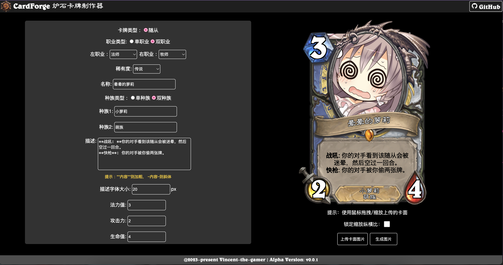
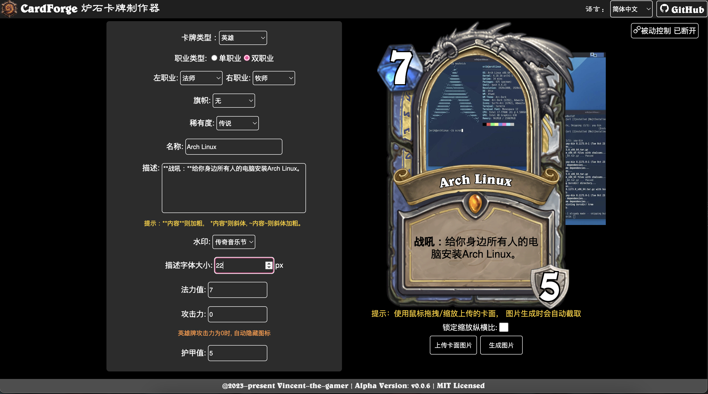
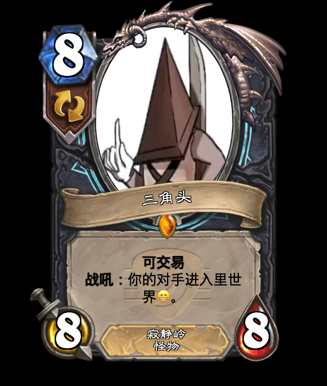
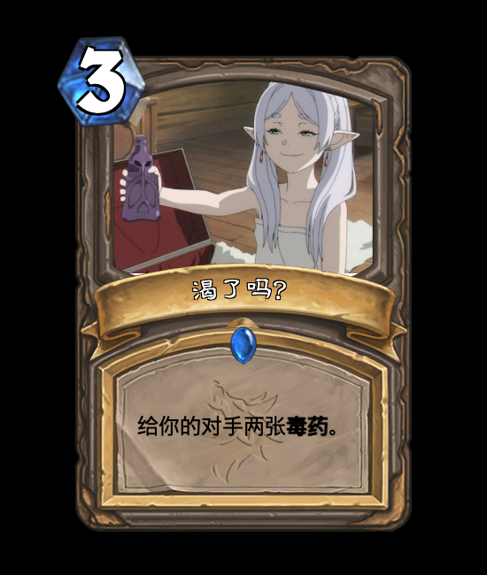
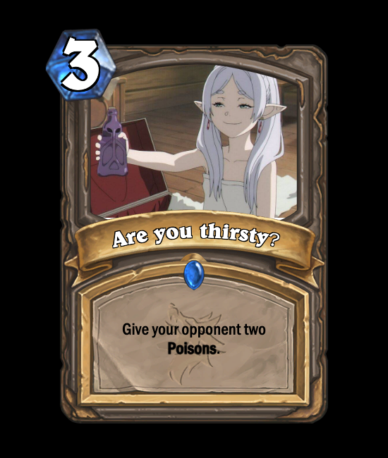
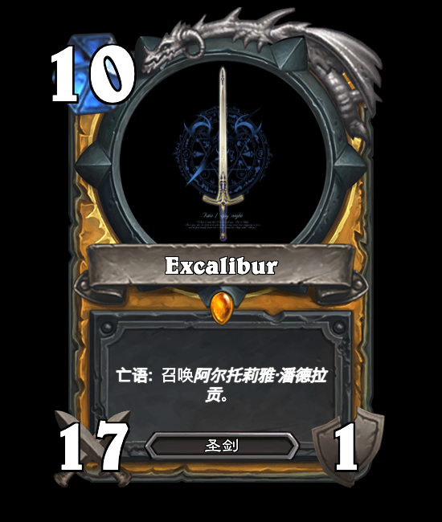
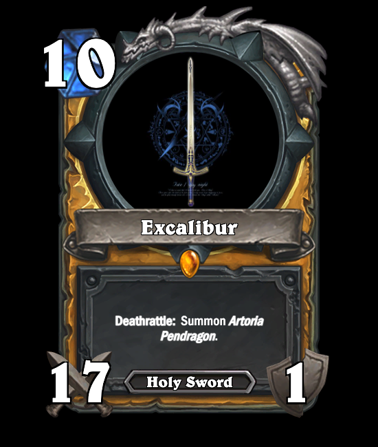
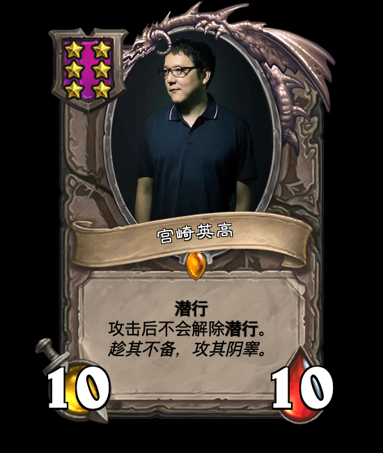
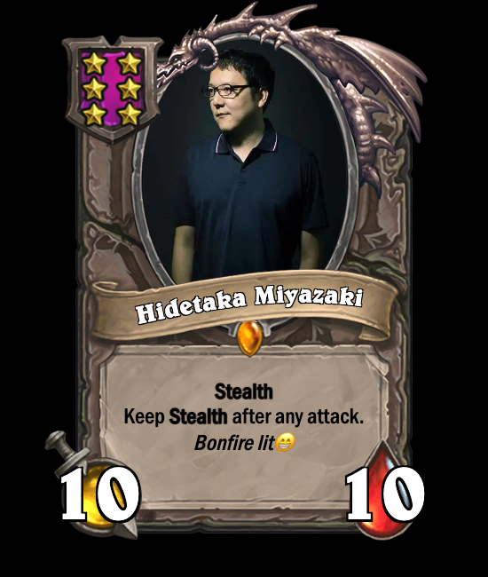

 

<h1 align="center">CardForge</h1>

A HearthStone card DIY tool.

Alpha Version: V0.0.5

# Notice

This repo is not final, now it can only generate 
- `Minion Cards`
- `Spell Cards`
- `Battlegrounds Minion Cards`
- `Weapon Cards`

# Features
- 💪 Real-time card part switching --- Card is built by tiny parts instead of pre-exported pictures.
- 🌏 i18n --- multi-language support.
- 👀 Keep Newest --- Sync with latest version of HearthStone game.
- 😁 High Similarity --- try my best to make the cards look like those in game.
- 🆒 Remote Control --- use your code to call websocket server for controlling page, then get your picture^_^

# Play

Play it at：

[https://vincent-the-gamer.github.io/cardforge-live-page/](https://vincent-the-gamer.github.io/cardforge-live-page/)

# Changelog

View Changelog:  [Changelog](./CHANGELOG.md)

# Preview

PS: Not final.

## UI
`i18n` is supported now!!

English:

Simplified Chinese(简体中文):

## Minion
| Chinese | English |
|  -      |   -     | 
|          |          |

## Spell
| Chinese | English |
|  -      |   -     | 
|          |          |

## Weapon
| Chinese | English |
|  -      |   -     | 
|         |     |

## Battlegrounds Minion
| Chinese | English |
|  -      |   -     | 
|         |     |

# License
[MIT](./LICENSE)