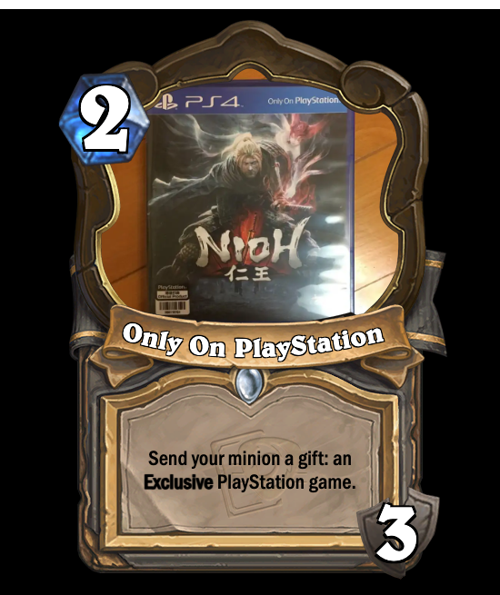

<h1 align="center">CardForge</h1>

A HearthStone card maker.

Version: V1.0.0

    

    English
    |
    <a href="./README_zh.md">中文文档</a>

> [!NOTE]
> This repo is in progress, some details will be added in the future.

# Features
- 💪 Real-time card part switching --- Card is built by tiny parts instead of pre-exported pictures.
- 🌏 i18n --- multi-language support.
- 👀 Keep Newest --- Sync with latest version of HearthStone game.
- 😁 High Similarity --- try my best to make the cards look like those in game.
- PWA(Progress Web Application) --- Support offline use on desktop/mobile devices.

# Play

## Online
Play it online at：

[https://vincent-the-gamer.github.io/cardforge-live-page/](https://vincent-the-gamer.github.io/cardforge-live-page/)

## PWA

This page supports PWA download now! you can download it to your PC or mobile devices!

# Changelog

View Changelog:  [Changelog](./CHANGELOG.md)

# Preview

PS: Not final.

## UI
`i18n` is supported now!!

English:

Simplified Chinese(简体中文):

## Minion
| Chinese | English |
|  -      |   -     | 
|          |          |

## Spell
| Chinese | English |
|  -      |   -     | 
|          |          |

## Weapon
| Chinese | English |
|  -      |   -     | 
|         |     |

## Battlegrounds Minion
| Chinese | English |
|  -      |   -     | 
|         |     |

## Hero
| Chinese | English |
|  -      |   -     | 
|         |     |

## Location
| Chinese | English |
|  -      |   -     | 
|         |     |

# License
[MIT](./LICENSE)