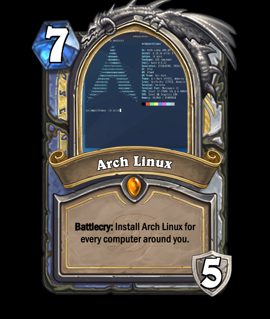

<p align="center" style="height: 100px;">
 
</p>
<h1 align="center">CardForge</h1>

<p align="center">A HearthStone card DIY tool.</p>

<p align="center" style="font-style: italic;">Alpha Version: V0.0.6</p>

<p align="center">
    <a href="https://github.com/vincent-the-gamer/cardforge/blob/main/LICENSE" target="_blank">
        
    </a>
</p>

# Notice

This repo is not final, now it can only generate 
- `Minion Cards`
- `Spell Cards`
- `Battlegrounds Minion Cards`
- `Weapon Cards`
- `Hero Cards`

# Features
- 💪 Real-time card part switching --- Card is built by tiny parts instead of pre-exported pictures.
- 🌏 i18n --- multi-language support.
- 👀 Keep Newest --- Sync with latest version of HearthStone game.
- 😁 High Similarity --- try my best to make the cards look like those in game.
- 🆒 [Passive Control](#passive-control) --- call websocket server to control your web page, then get your picture^_^.

## Feature Details
### Passive Control 
Server required. Download it in [v0.0.6 Alpha Release](https://github.com/Vincent-the-gamer/cardforge/releases/tag/v0.0.6-alpha).

#### How to use `Passive Control Server`
- [Download](https://github.com/Vincent-the-gamer/cardforge/releases/tag/v0.0.6-alpha).

- Run! Server uses port 8081. 

PS: Server will allow user to choose a port in the future.

#### Demo
Send JSON message to websocket server to control your webpage. (Please do not close your webpage.)

🚧 Warning: 🚧
the card face picture will have a fixed position and size in `Passive Control Mode` , so please
adjust picture yourselves. 

Using this data structure to control the page.
```js
{
    "language": "en",
    "cardType": "spell",
    "classType": "dual",
    "cardClass": "mage",    // Only work while classType === "single"
    "leftClass": "warrior", // Only work while classType === "dual"
    "rightClass": "hunter", // Only work while classType === "dual"
    "rarity": "rare",
    "name": "Test",
    "kindType": "dual",
    "cardKind": "kind",  // Only work while cardKind === "single"
    "upKind": "kind1",   // Only work while cardKind === "dual"
    "downKind": "kind2", // Only work while cardKind === "dual"
    "description": "**Battlecry**: Testing.",
    "watermark": "year-of-the-wolf",
    "desFontSize": 20,
    "cost": 3,
    "vitality": 3, // Work in Minion, Battleground Minion, Hero(Armor) 
    "armor": 3,  // Alias of vitality on Hero Cards
    "durability": 3, // Alias of vitality on Weapon Cards
    "cardFaceUrl": "https://image-static.segmentfault.com/596/308/596308474-6389c86c5126c_cover"
}
```


# Play

Play it at：

[https://vincent-the-gamer.github.io/cardforge-live-page/](https://vincent-the-gamer.github.io/cardforge-live-page/)

# Changelog

View Changelog:  [Changelog](./CHANGELOG.md)

# Preview

PS: Not final.

## UI
`i18n` is supported now!!

English:


Simplified Chinese(简体中文):


## Minion
| Chinese | English |
|  -      |   -     | 
|          |          |

## Spell
| Chinese | English |
|  -      |   -     | 
|          |          |

## Weapon
| Chinese | English |
|  -      |   -     | 
|         |     |


## Battlegrounds Minion
| Chinese | English |
|  -      |   -     | 
|         |     |

## Hero
| Chinese | English |
|  -      |   -     | 
|         |     |

# License
[MIT](./LICENSE)