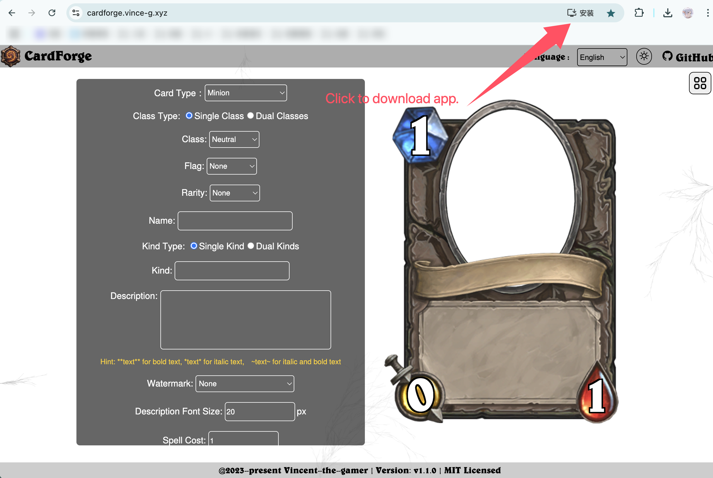

<h1 align="center">CardForge</h1>

炉石传说卡牌制作器

版本: V1.0.0

    

    <a href="./README.md">English</a>
    |
    中文文档

> [!NOTE]
> 这个仓库的内容尚未完成，还有很多细节没有添加。

# 特性
- 💪 实时卡牌部件切换 --- 不使用预导出的完整卡牌框架，而将部件拆分并使用菜单实时切换。
- 🌏 i18n（国际化） --- 多语言支持。
- 👀 保持最新 --- 和最新版炉石传说内容保持同步。
- 😁 高相似度 --- 卡牌样式尽量还原游戏中的样式。
- **PWA**(渐进式Web应用) --- 支持在桌面/移动端离线使用。

# 游玩

## 在线版

在该地址游玩网页版生成器：

[https://vincent-the-gamer.github.io/cardforge-live-page/](https://vincent-the-gamer.github.io/cardforge-live-page/)

## PWA

该网页已支持PWA下载! 你可以在电脑/移动端下载离线版App!

# 版本修改日志

查看日志:  [版本修改日志](./CHANGELOG.md)

# 预览

## UI
`i18n` 多语言已支持!!

英语:

简体中文:

## 随从
| 中文 | 英语 |
|  -      |   -     | 
|          |          |

## 法术
| 中文 | 英语 |
|  -      |   -     | 
|          |          |

## 武器
| 中文 | 英语 |
|  -      |   -     | 
|         |     |

## 酒馆战棋随从
| 中文 | 英语 |
|  -      |   -     | 
|         |     |

## 英雄
| 中文 | 英语 |
|  -      |   -     | 
|         |     |

## 地标
| 中文 | 英语 |
|  -      |   -     | 
|         |     |

# 开源许可
[MIT](./LICENSE)