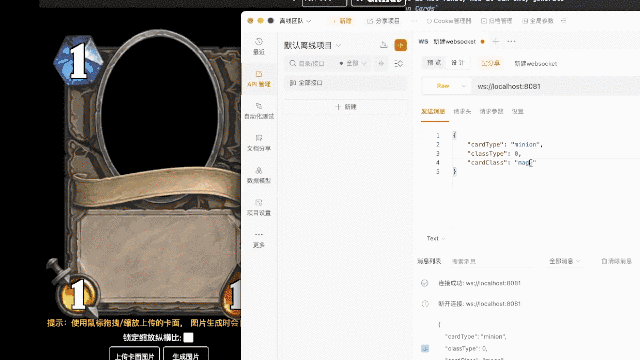
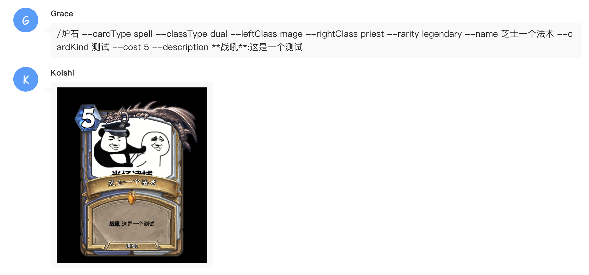
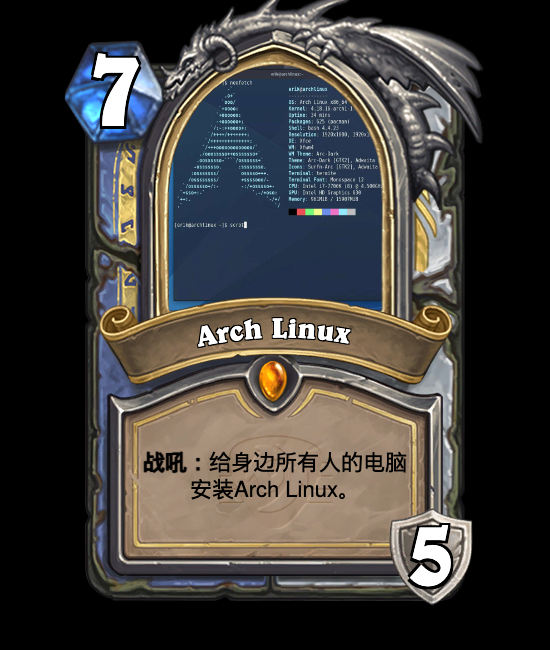
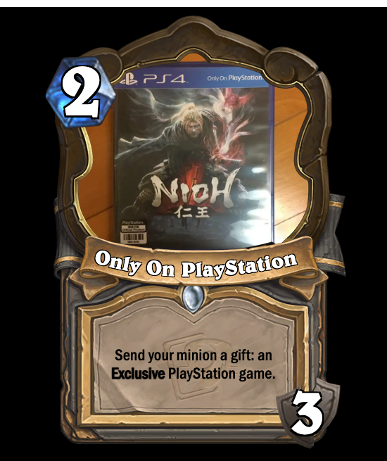

<h1 align="center">CardForge</h1>

<p align="center">炉石传说卡牌制作器</p>

<p align="center" style="font-style: italic;">内测版本: V0.1.4</p>

<p align="center">
    <a href="https://github.com/vincent-the-gamer/cardforge/blob/main/LICENSE" target="_blank">
        
    </a>
</p>

<p align="center">
    <a href="./README.md">English</a>
    <span>|</span>
    <span>中文文档</span>
</p>

> [!NOTE]
> 这个仓库的内容尚未完成，还有很多细节没有添加。

# 特性
- 💪 实时卡牌部件切换 --- 不使用预导出的完整卡牌框架，而将部件拆分并使用菜单实时切换。
- 🌏 i18n（国际化） --- 多语言支持。
- 👀 保持最新 --- 和最新版炉石传说内容保持同步。
- 😁 高相似度 --- 卡牌样式尽量还原游戏中的样式。
- 🆒 [被动控制](#被动控制) --- 调用WebSocket服务来反向控制网页输出图片^_^。

## 特性的详细说明
### 被动控制 
需要服务端。下载：[v0.0.6 Alpha Release](https://github.com/Vincent-the-gamer/cardforge/releases/tag/v0.0.6-alpha).

#### 如何使用被动控制服务端 `Passive Control Server`
- [下载](https://github.com/Vincent-the-gamer/cardforge/releases/tag/v0.0.6-alpha).

- 运行!
  ```shell
  # 默认运行在8081端口
  ./cardforge-passive-server
  cardforge-passive-server.exe

  # 使用自定义端口运行
  ./cardforge-passive-server 9000
  cardforge-passive-server.exe 9000
  ```

#### 演示
发送JSON字符串来控制页面。(被动控制模式打开时请勿关闭网页。)

🚧 提醒: 🚧
在`被动控制模式`下，卡面图片的位置和大小是`固定的`，所以请自己修图。

使用这个数据结构来控制页面。

PS：发送消息时请勿带上注释（JSON里面本来也不应该有注释）

```js
{
    "language": "en",
    "cardType": "spell",
    "classType": "dual",
    "cardClass": "mage",    // 仅在 classType === "single" 时有效。
    "leftClass": "warrior", // 仅在 classType === "dual" 时有效。
    "rightClass": "hunter", // 仅在 classType === "dual" 时有效。
    "rarity": "rare",
    "name": "Test",
    "kindType": "dual",
    "cardKind": "kind",  // 仅在 cardKind === "single" 时有效
    "upKind": "kind1",   // 仅在 cardKind === "dual" 时有效
    "downKind": "kind2", // 仅在 cardKind === "dual" 时有效
    "description": "**Battlecry**: Testing.",
    "watermark": "year-of-the-wolf",
    "desFontSize": 20,
    "cost": 3,
    "vitality": 3, // 在随从，酒馆战棋随从，武器（耐久度）, 英雄（护甲）,地标（耐久度）时有效
    "armor": 3,  // 在英雄牌中是生命值的别名
    "durability": 3, // 在武器/地标中是耐久度的别名
    "cardFaceUrl": "https://image-static.segmentfault.com/596/308/596308474-6389c86c5126c_cover" // 图片url, 支持网络图片
}
```




#### 和Koishi插件交互

Koishi是啥？一个多平台支持的机器人框架。

链接: [Koishi.js](https://koishi.chat/zh-CN/)

使用 `被动控制服务` 就可以对接机器人.



插件之后写完再发布。


# 游玩

在该地址游玩网页版生成器：

[https://vincent-the-gamer.github.io/cardforge-live-page/](https://vincent-the-gamer.github.io/cardforge-live-page/)

# 版本修改日志

查看日志:  [版本修改日志](./CHANGELOG.md)

# 预览

## UI
`i18n` 多语言已支持!!

英语:


简体中文:


## 随从
| 中文 | 英语 |
|  -      |   -     | 
|          |          |

## 法术
| 中文 | 英语 |
|  -      |   -     | 
|          |          |

## 武器
| 中文 | 英语 |
|  -      |   -     | 
|         |     |


## 酒馆战棋随从
| 中文 | 英语 |
|  -      |   -     | 
|         |     |

## 英雄
| 中文 | 英语 |
|  -      |   -     | 
|         |     |

## 地标
| 中文 | 英语 |
|  -      |   -     | 
|         |     |

# 开源许可
[MIT](./LICENSE)