<h1 align="center">CardForge</h1>

炉石传说卡牌制作器

    

    <a href="./README.md">English</a>
    |
    中文文档

# 特性

- 💪 实时卡牌部件切换 --- 不使用预导出的完整卡牌框架，而将部件拆分并使用菜单实时切换。
- 🌏 i18n（国际化） --- 多语言支持。
- 👀 保持最新 --- 和最新版炉石传说内容保持同步。
- 😁 高相似度 --- 卡牌样式尽量还原游戏中的样式。
- **PWA**(渐进式Web应用) --- 支持在桌面/移动端离线使用。

# 游玩

## 在线版

在该地址游玩网页版生成器：

[https://vincent-the-gamer.github.io/cardforge-live-page/](https://vincent-the-gamer.github.io/cardforge-live-page/)

## PWA

该网页已支持PWA下载! 你可以在电脑/移动端下载离线版App!

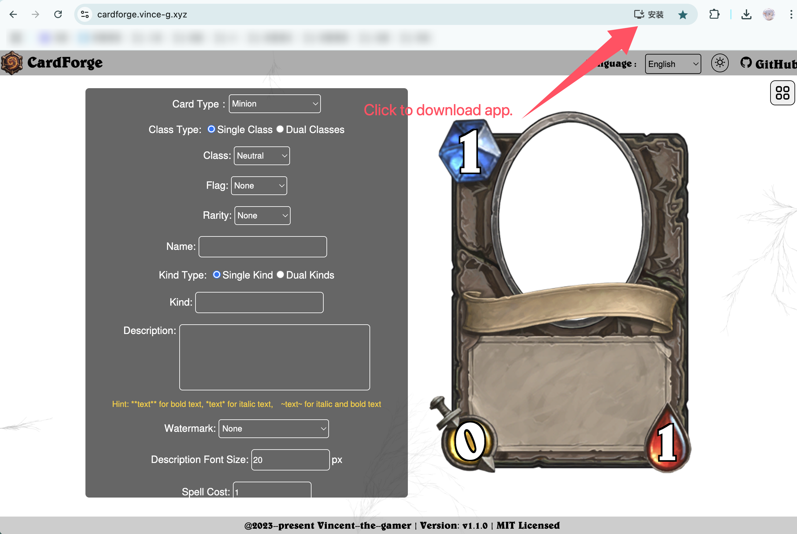

# 版本修改日志

查看日志: [版本修改日志](./CHANGELOG.md)

# 预览

## UI

`i18n` 多语言已支持!!

英语:

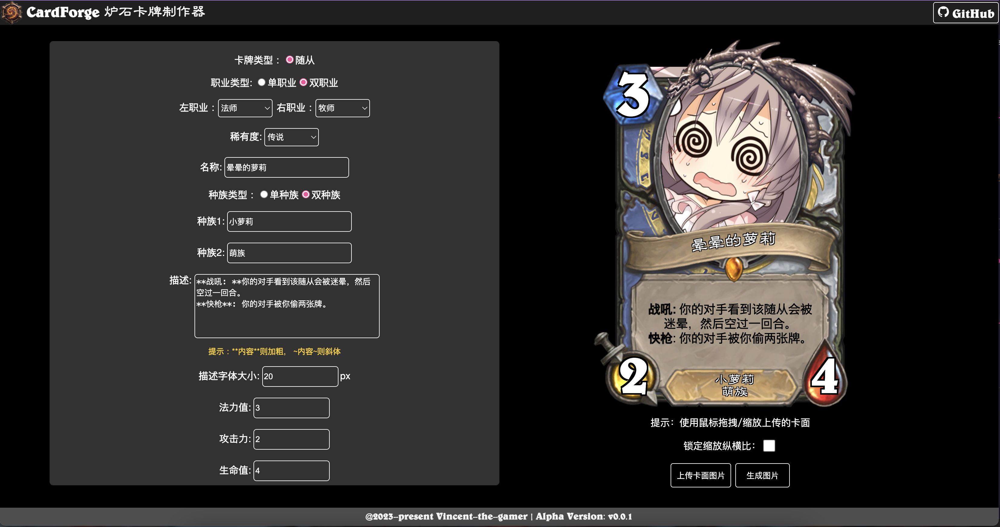

简体中文:
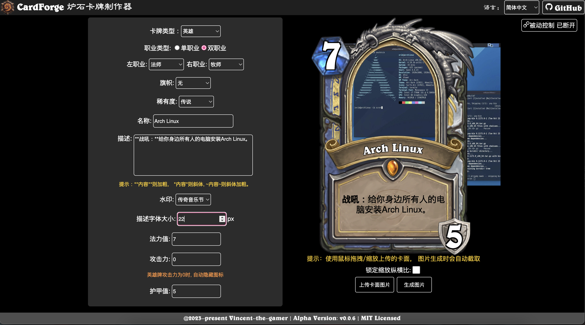

## 随从

| 中文                                        | 英语                                        |
| ------------------------------------------- | ------------------------------------------- |
| 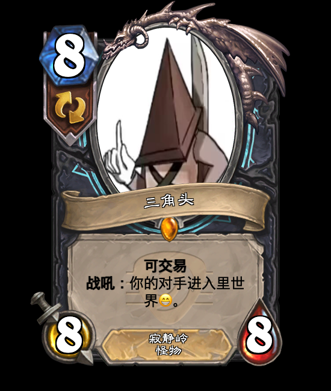 |  |

## 法术

| 中文                                      | 英语                                      |
| ----------------------------------------- | ----------------------------------------- |
| 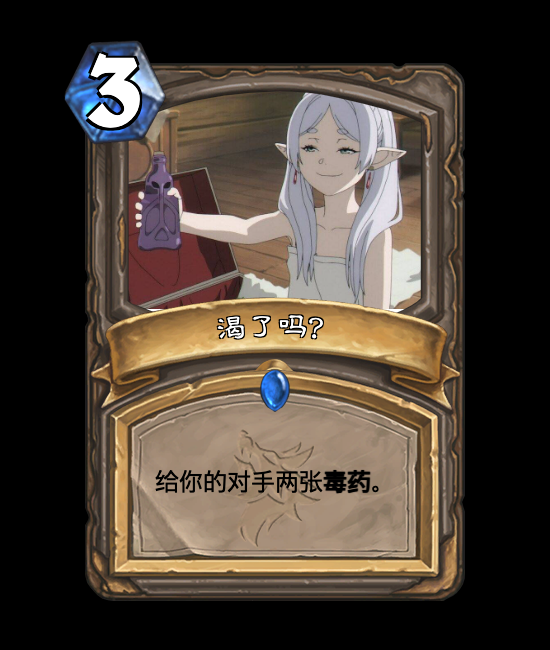 | 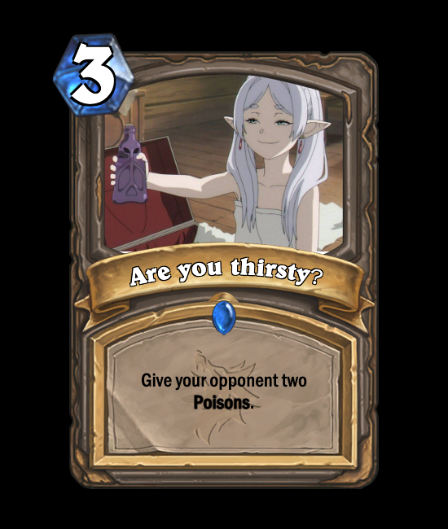 |

## 武器

| 中文                                        | 英语                                        |
| ------------------------------------------- | ------------------------------------------- |
| 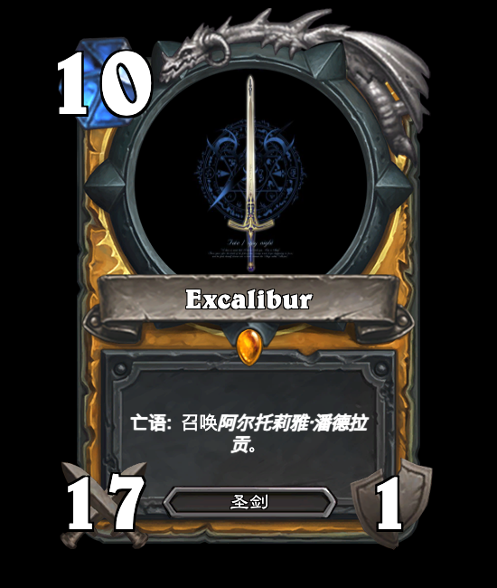 | 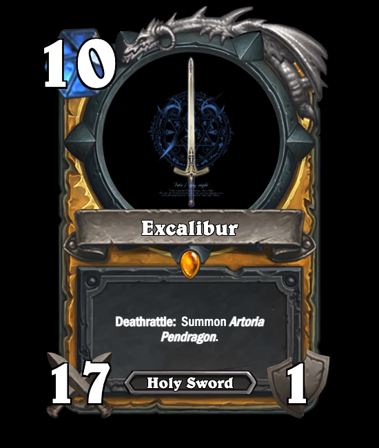 |

## 酒馆战棋随从

| 中文                                                      | 英语                                                      |
| --------------------------------------------------------- | --------------------------------------------------------- |
| 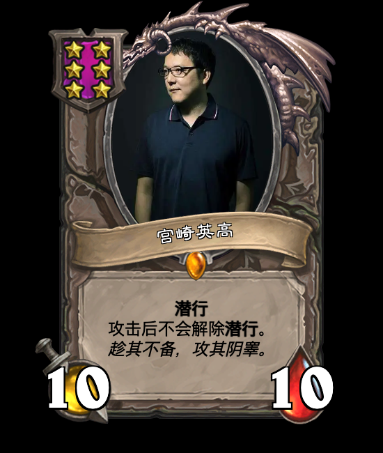 |  |

## 英雄

| 中文                                    | 英语                                    |
| --------------------------------------- | --------------------------------------- |
| 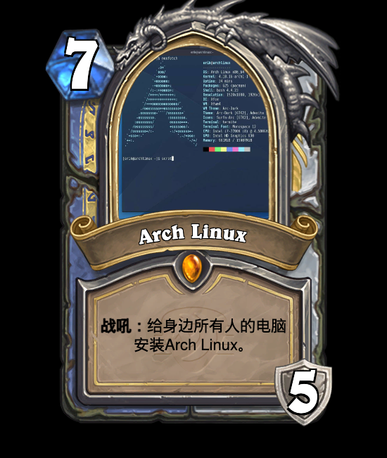 |  |

## 地标

| 中文                                        | 英语                                        |
| ------------------------------------------- | ------------------------------------------- |
|  | 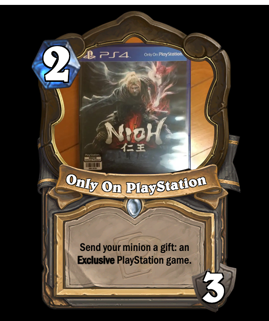 |

# 开源许可

[MIT](./LICENSE)
